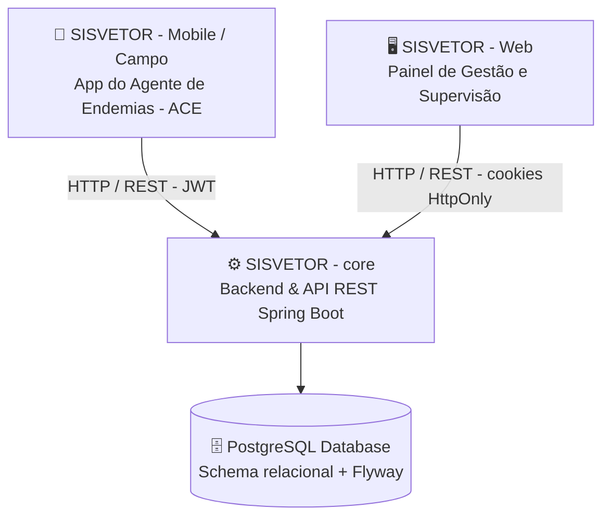

# 🦟 SISVETOR - core

> **API REST e Núcleo de Processamento do Sistema Integrado de Vigilância e Controle de Vetores e Endemias (SISVETOR).**

[](https://openjdk.org/)
[](https://spring.io/projects/spring-boot)
[](https://www.postgresql.org/)
[](https://flywaydb.org/)
[](https://jwt.io/)

---

## 📌 Sobre o Projeto SISVETOR

O **SISVETOR** é um projeto autônomo desenvolvido com o objetivo de **informatizar, modernizar e agilizar o setor municipal de combate às endemias e vigilância ambiental** (com foco no controle de vetores de arboviroses como Dengue, Zika, Chikungunya e Febre Amarela).

O sistema substitui processos manuais e formulários físicos em papel (boletins diários de campo, fichas de visita domiciliar e planilhas de LIRAa), viabilizando:
- Mapeamento e estruturação territorial até o nível de imóvel e face de quarteirão;
- Acompanhamento em tempo real dos ciclos de trabalho dos Agentes de Combate às Endemias (ACE);
- Registro e controle de tratamentos focais e perifocais;
- Monitoramento de índices de infestação predial e coleta de amostras/focos para análise laboratorial.

---

## 🌐 Ecossistema SISVETOR

O ecossistema **SISVETOR** é composto por três repositórios integrados:



1. **[SISVETOR - core](.)** *(este repositório)*: Backend desenvolvido em Spring Boot, responsável pelas regras de negócio, autenticação/autorização, cálculos epidemiológicos, versionamento de banco de dados e APIs REST.
2. **SISVETOR - Web**: Aplicação Web para supervisores, coordenadores e secretarias municipais de saúde, com dashboards analíticos, emissão de relatórios, mapeamento territorial e gestão de equipes.
3. **SISVETOR - Mobile**: Aplicativo móvel para utilização em campo pelos Agentes de Combate às Endemias (ACE), com suporte a coletas domiciliares, leitura de rotas e sincronização de dados.

---

## 🚀 Funcionalidades do SISVETOR - core

### 🗺️ Gestão Territorial e Cadastral
- **Localidades**: Cadastro de bairros, povoados, sítios e fazendas (Sede e Outros).
- **Áreas e Quarteirões**: Divisão territorial por áreas de abrangência e numeração sequencial de quarteirões.
- **Lados (Faces de Quadra)**: Associação de logradouros e lados de quarteirão.
- **Imóveis**: Cadastro ordenado de imóveis residenciais, comerciais, terrenos baldios e outros, com contagem de moradores e animais (cães e gatos).

### 👥 Gestão de Agentes e Usuários
- Cadastro de agentes com matrícula, CPF e papéis hierárquicos: `CAMPO` (ACE), `SUPERVISOR` e `COORDENADOR`.
- Controle de acesso baseado em papéis (RBAC), JWT para Android e cookies HttpOnly para o web. Os fluxos de login, renovação e CSRF estão em [AUTENTICACAO.md](AUTENTICACAO.md).

### 📅 Ciclos de Trabalho e Planejamento
- Acompanhamento dos ciclos anuais/bimestrais de visitação com controle de datas de início/fim e status de conclusão.

### 🏠 Visitas Domiciliares e Tratamentos
- Registro detalhado de inspeções domiciliares com status da visita (`TRABALHADO`, `RECUPERADO`, `FECHADO`, `RECUSADO`).
- Registro de ações mecânicas (quantidade de depósitos eliminados) e químicas (tratamento focal/perifocal, quantidade e tipo de larvicida).

### 🔬 Vigilância Entomológica e LIRAa
- Registro de dados do Levantamento Rápido de Índices para *Aedes aegypti* (LIRAa).
- Notificação de focos e tubitos de amostras para análise laboratorial, classificados segundo a tabela oficial do Ministério da Saúde:
  - **A1/A2**: Caixas d'água e reservatórios elevados/nível de solo.
  - **B**: Pequenos depósitos móveis (vasos, garrafas, pratos).
  - **C**: Depósitos fixos (calhas, ralos, piscinas, tanques).
  - **D1/D2**: Pneus e lixo/entulho/recicláveis.
  - **E**: Depósitos naturais (ocos de árvores, bromélias, bambus).

---

## 🛠️ Tecnologias e Dependências

- **Linguagem**: [Java 26](https://openjdk.org/)
- **Framework**: [Spring Boot 4.1.1](https://spring.io/projects/spring-boot)
  - `spring-boot-starter-webmvc` (Construção de APIs RESTful)
  - `spring-boot-starter-data-jpa` (Persistência e ORM com Hibernate)
  - `spring-boot-starter-security` (Segurança, Criptografia e RBAC)
  - `spring-boot-starter-validation` (Validação de DTOs e Bean Validation)
  - `spring-boot-starter-actuator` (Monitoramento e métricas da aplicação)
- **Banco de Dados**: [PostgreSQL](https://www.postgresql.org/)
- **Migrações de Banco**: [Flyway Database Migration](https://flywaydb.org/)
- **Autenticação**: [Auth0 java-jwt 4.5.2](https://github.com/auth0/java-jwt)
- **Utilitários**: [Project Lombok](https://projectlombok.org/)

---

## ⚙️ Como Executar a Aplicação

### Docker Compose: desenvolvimento

É necessário ter Docker com o plugin Compose. O build usa Java 26 dentro da imagem, independentemente do JDK instalado no host.

```bash
cp .env.example .env
```

Preencha `POSTGRES_PASSWORD` e `JWT_SECRET` no `.env` com valores aleatórios próprios. O segredo JWT deve ter pelo menos 32 caracteres. Ajuste `AUTH_WEB_ALLOWED_ORIGINS` para a origem exata do frontend local, sem barra final; se houver várias origens, separe por vírgula. Depois execute:

```bash
docker compose up -d --build
docker compose ps
docker compose logs -f api
```

A API responde em `http://localhost:8080` e o PostgreSQL em `localhost:5433` por padrão. Ambas as portas ficam vinculadas ao loopback. O endpoint público `GET /api/v1/actuator/health` informa a saúde da API. O banco inicia antes da API, que executa as migrations Flyway. Para parar sem apagar os dados:

```bash
docker compose down
```

Os dados ficam no volume nomeado `postgres_data`. `docker compose down -v` remove esse volume e seus dados.

O Dockerfile compila o JAR com `-DskipTests`. Para executar os testes separadamente com Java 26, use:

```bash
docker run --rm --user "$(id -u):$(id -g)" -v "$PWD":/workspace -w /workspace maven:3.9.16-eclipse-temurin-26-noble mvn -B -Dmaven.repo.local=/tmp/m2 test
```

### Docker Compose: produção

O arquivo `compose.prod.yaml` é independente do Compose de desenvolvimento. Configure `AUTH_WEB_ALLOWED_ORIGINS` no `.env` com a origem HTTPS exata do frontend e crie os secrets locais antes de iniciar:

```bash
mkdir -p secrets
chmod 700 secrets
openssl rand -hex 32 | tr -d '\n' > secrets/db_password
openssl rand -hex 32 | tr -d '\n' > secrets/JWT_SECRET
chmod 644 secrets/db_password secrets/JWT_SECRET
docker compose -f compose.prod.yaml up -d --build
docker compose -f compose.prod.yaml ps
docker compose -f compose.prod.yaml logs -f api
```

O PostgreSQL de produção não publica porta. A API escuta apenas em `127.0.0.1:8080` no host, para encaminhamento por um proxy HTTPS externo. Configure o proxy para preservar o host e encaminhar `/api/v1/` à API. Cookies web usam `Secure`, `HttpOnly` e `SameSite=Lax`; o frontend deve usar `credentials: "include"` e as rotas CSRF descritas em [AUTENTICACAO.md](AUTENTICACAO.md). O Compose monta os arquivos `secrets/db_password` e `secrets/JWT_SECRET` como secrets; o Spring lê os arquivos montados por `configtree:`. Mantenha o proxy, frontend e API no mesmo site para o fluxo de cookies. Use HTTPS no acesso público.

Para parar e preservar o banco:

```bash
docker compose -f compose.prod.yaml down
```

O `.env` e `secrets/` ficam fora do Git. O diretório `secrets/` com permissão `700` impede o acesso de outros usuários do host; os arquivos precisam ter leitura (`644`) porque o Compose local os monta no container e a API executa sem privilégios. Não compartilhe os valores desses arquivos. Para testar os arquivos Compose sem iniciar serviços, use `docker compose config -q` ou `docker compose -f compose.prod.yaml config -q` após configurar o ambiente.

### Coordenador inicial

O bootstrap fica desativado por padrão nos dois ambientes. Somente na primeira inicialização, defina `BOOTSTRAP_COORDINATOR_ENABLED=true` e preencha `BOOTSTRAP_COORDINATOR_NOME`, `BOOTSTRAP_COORDINATOR_CPF`, `BOOTSTRAP_COORDINATOR_MATRICULA`, `BOOTSTRAP_COORDINATOR_EMAIL` e `BOOTSTRAP_COORDINATOR_PASSWORD` no `.env`. A senha precisa ter pelo menos 12 caracteres. Depois de criar o coordenador, volte a opção para `false`, remova a senha do `.env` e recrie a API com `docker compose up -d --force-recreate api` (acrescente `-f compose.prod.yaml` em produção). O login usa `POST /api/v1/auth/login` para Android e `POST /api/v1/auth/web/login` para web.

### Executar sem Docker

### Pré-requisitos
- **JDK 26** instalado e configurado nas variáveis de ambiente.
- **PostgreSQL 14+** em execução.
- **Maven** (ou utilizar o wrapper `./mvnw` incluso no repositório).

### 1. Clonar o Repositório
```bash
git clone https://github.com/seu-usuario/sisvetor-core.git
cd sisvetor-core
```

### 2. Configurar o Banco de Dados
Certifique-se de que o banco de dados PostgreSQL está criado. Por padrão, a aplicação conecta-se à seguinte base:

```sql
CREATE DATABASE endemias;
```

As configurações podem ser ajustadas no arquivo `src/main/resources/application.properties` ou via variáveis de ambiente:

```properties
spring.application.name=endemias

spring.datasource.url=jdbc:postgresql://localhost:5432/endemias
spring.datasource.username=postgres
spring.datasource.password=manager

spring.jpa.hibernate.ddl-auto=validate
spring.jpa.show-sql=true
spring.jpa.properties.hibernate.dialect=org.hibernate.dialect.PostgreSQLDialect

spring.flyway.enabled=true
spring.flyway.locations=classpath:db/migration
```

### 3. Compilar e Executar
Execute o projeto através do Maven Wrapper:

```bash
# No Linux/macOS:
./mvnw spring-boot:run

# No Windows:
mvnw.cmd spring-boot:run
```

A API estará disponível por padrão em `http://localhost:8080`.

---

## 🤝 Repositórios Integrados do SISVETOR

- 🖥️ **[SISVETOR - Web](https://github.com/alison-andrade/sisvetor-web)**: Interface web para coordenação e supervisão municipal.
- 📱 **[SISVETOR - Mobile](https://github.com/alison-andrade/sisvetor-mobile)**: Aplicativo móvel para coleta de campo pelos Agentes de Combate às Endemias.
- ⚙️ **[SISVETOR - core](https://github.com/alison-andrade/sisvetor-core)**: Backend e API REST (este repositório).

---

## 📄 Licença

Este projeto é desenvolvido para fins de modernização do setor de saúde pública municipal. Consulte o arquivo `LICENSE` para maiores detalhes sobre os termos de uso.
